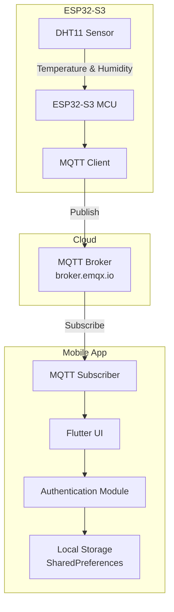
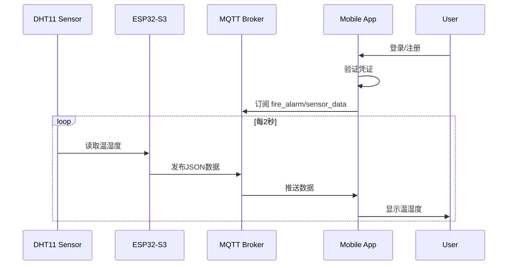

# Design Document

## Overview

本设计文档描述了小区火灾报警系统的MQTT通信与手机APP交互功能的技术架构和实现方案。系统由三个主要部分组成：

1. **ESP32-S3固件** - 负责采集DHT11传感器数据并通过MQTT协议发布
2. **MQTT Broker** - 使用公共MQTT服务器（如EMQX公共服务器）进行消息路由
3. **Flutter手机APP** - 跨平台移动应用，提供用户认证和数据展示功能

## Architecture



### 通信流程



## Components and Interfaces

### 1. ESP32-S3 MQTT模块

**文件结构：**
- `include/MY_MQTT.h` - MQTT功能头文件
- `src/MY_MQTT.cpp` - MQTT功能实现

**接口定义：**

```cpp
// MY_MQTT.h
#ifndef __MY_MQTT_H__
#define __MY_MQTT_H__

#include <WiFi.h>
#include <PubSubClient.h>

// WiFi配置
extern const char* WIFI_SSID;
extern const char* WIFI_PASSWORD;

// MQTT配置
extern const char* MQTT_BROKER;
extern const int MQTT_PORT;
extern const char* MQTT_TOPIC;
extern const char* MQTT_CLIENT_ID;

// 函数声明
void setupWiFi();
void setupMQTT();
void reconnectMQTT();
void publishSensorData(float temperature, float humidity);
String createJsonPayload(float temperature, float humidity);

extern WiFiClient espClient;
extern PubSubClient mqttClient;
extern TaskHandle_t mqttTaskHandle;

void mqttTask(void *pvParameters);

#endif
```

### 2. Flutter Mobile App模块

**项目结构：**
```
fire_alarm_app/
├── lib/
│   ├── main.dart
│   ├── models/
│   │   ├── user.dart
│   │   └── sensor_data.dart
│   ├── services/
│   │   ├── auth_service.dart
│   │   └── mqtt_service.dart
│   ├── screens/
│   │   ├── login_screen.dart
│   │   ├── register_screen.dart
│   │   └── dashboard_screen.dart
│   ├── widgets/
│   │   ├── sensor_card.dart
│   │   └── loading_indicator.dart
│   └── utils/
│       └── constants.dart
├── pubspec.yaml
└── ...
```

**核心服务接口：**

```dart
// auth_service.dart
abstract class AuthService {
  Future<bool> register(String username, String password);
  Future<bool> login(String username, String password);
  Future<void> logout();
  Future<bool> isLoggedIn();
  Future<String?> getCurrentUser();
}

// mqtt_service.dart
abstract class MqttService {
  Future<void> connect();
  void disconnect();
  Stream<SensorData> get sensorDataStream;
  bool get isConnected;
}
```

### 3. 数据模型

```dart
// sensor_data.dart
class SensorData {
  final double temperature;
  final double humidity;
  final DateTime timestamp;
  final String deviceId;
  
  SensorData({
    required this.temperature,
    required this.humidity,
    required this.timestamp,
    required this.deviceId,
  });
  
  factory SensorData.fromJson(Map<String, dynamic> json);
  Map<String, dynamic> toJson();
}

// user.dart
class User {
  final String username;
  final String passwordHash;
  
  User({required this.username, required this.passwordHash});
  
  factory User.fromJson(Map<String, dynamic> json);
  Map<String, dynamic> toJson();
}
```

## Data Models

### MQTT消息格式

**传感器数据JSON结构：**
```json
{
  "device_id": "esp32_fire_alarm_001",
  "temperature": 25.5,
  "humidity": 60.2,
  "timestamp": 1703232000000,
  "unit": {
    "temperature": "celsius",
    "humidity": "percent"
  }
}
```

### 本地存储数据结构

**用户凭证存储（SharedPreferences）：**
```
Key: "users" -> JSON Array of User objects
Key: "current_user" -> String (username)
Key: "session_token" -> String (hashed session)
```

## Error Handling

### ESP32-S3错误处理

| 错误类型 | 处理策略 |
|---------|---------|
| WiFi连接失败 | 每5秒重试，最多10次后重启 |
| MQTT连接失败 | 每5秒重试，持续尝试 |
| DHT11读取失败 | 跳过本次发布，下次重试 |
| JSON序列化失败 | 记录错误日志，跳过发布 |

### Mobile App错误处理

| 错误类型 | 处理策略 |
|---------|---------|
| MQTT连接失败 | 显示错误提示，提供重试按钮 |
| JSON解析失败 | 忽略无效消息，保持上次有效数据 |
| 登录失败 | 显示错误消息，允许重试 |
| 注册失败 | 显示具体错误原因 |


## Correctness Properties

*A property is a characteristic or behavior that should hold true across all valid executions of a system-essentially, a formal statement about what the system should do. Properties serve as the bridge between human-readable specifications and machine-verifiable correctness guarantees.*

Based on the acceptance criteria analysis, the following correctness properties have been identified:

### Property 1: Sensor Data Formatting Consistency

*For any* temperature value and humidity value, the formatted display string SHALL contain exactly one decimal place and the appropriate unit ("°C" for temperature, "%" for humidity).

**Validates: Requirements 1.3, 1.4**

### Property 2: Username Validation

*For any* string, if the string length is between 4 and 20 characters (inclusive), the username validation SHALL return valid; otherwise, it SHALL return invalid with an appropriate error message.

**Validates: Requirements 2.2, 2.3**

### Property 3: Password Validation

*For any* string, if the string length is between 6 and 20 characters (inclusive), the password validation SHALL return valid; otherwise, it SHALL return invalid with an appropriate error message.

**Validates: Requirements 2.2, 2.3**

### Property 4: Duplicate Username Prevention

*For any* username that has been successfully registered, attempting to register the same username again SHALL fail with a duplicate username error.

**Validates: Requirements 2.4**

### Property 5: Login Credential Verification

*For any* registered user with username U and password P, logging in with credentials (U, P) SHALL succeed, and logging in with credentials (U, P') where P' ≠ P SHALL fail.

**Validates: Requirements 3.1, 3.2**

### Property 6: Session Persistence Round-Trip

*For any* successful login, the session token stored after login SHALL allow session restoration without requiring re-authentication.

**Validates: Requirements 3.3, 3.4**

### Property 7: Logout Clears Session

*For any* logged-in user, after logout, the session state SHALL indicate not logged in and require re-authentication.

**Validates: Requirements 3.5**

### Property 8: Temperature Warning Threshold

*For any* temperature value T, if T > 40.0, the UI state SHALL indicate warning mode; if T ≤ 40.0, the UI state SHALL indicate normal mode.

**Validates: Requirements 4.2**

### Property 9: Sensor Data JSON Round-Trip

*For any* valid SensorData object containing temperature, humidity, timestamp, and device_id, serializing to JSON and then deserializing SHALL produce an equivalent SensorData object.

**Validates: Requirements 5.1, 5.3**

### Property 10: Malformed JSON Handling

*For any* string that is not valid JSON or lacks required fields, the JSON parser SHALL return an error result without throwing an unhandled exception.

**Validates: Requirements 5.2, 5.4**

## Testing Strategy

### Testing Framework Selection

**ESP32-S3 (C++):**
- Unit Testing: PlatformIO Unity framework (built-in)
- Property-Based Testing: Not applicable for embedded code (limited resources)

**Flutter Mobile App (Dart):**
- Unit Testing: `flutter_test` package (built-in)
- Property-Based Testing: `glados` package for Dart property-based testing
- Widget Testing: `flutter_test` for UI component testing

### Dual Testing Approach

本项目采用双重测试策略：

1. **单元测试 (Unit Tests)** - 验证特定示例和边界情况
2. **属性测试 (Property-Based Tests)** - 验证在所有有效输入上都应成立的通用属性

### Unit Test Coverage

**ESP32-S3:**
- WiFi连接功能测试
- MQTT连接和发布功能测试
- JSON序列化功能测试
- DHT11数据读取集成测试

**Flutter App:**
- 用户模型序列化/反序列化测试
- 传感器数据模型测试
- 认证服务登录/注册流程测试
- MQTT服务连接测试

### Property-Based Test Requirements

每个属性测试必须：
- 运行至少100次迭代
- 使用注释标记对应的正确性属性：`**Feature: mqtt-mobile-app, Property {number}: {property_text}**`
- 使用智能生成器约束输入空间

**示例属性测试注释格式：**
```dart
// **Feature: mqtt-mobile-app, Property 9: Sensor Data JSON Round-Trip**
// **Validates: Requirements 5.1, 5.3**
test('sensor data serialization round-trip', () {
  // Property-based test implementation
});
```

### Test File Organization

```
fire_alarm_app/
├── test/
│   ├── unit/
│   │   ├── models/
│   │   │   ├── sensor_data_test.dart
│   │   │   └── user_test.dart
│   │   └── services/
│   │       ├── auth_service_test.dart
│   │       └── mqtt_service_test.dart
│   ├── property/
│   │   ├── sensor_data_property_test.dart
│   │   ├── auth_validation_property_test.dart
│   │   └── session_property_test.dart
│   └── widget/
│       ├── sensor_card_test.dart
│       └── login_screen_test.dart
```
