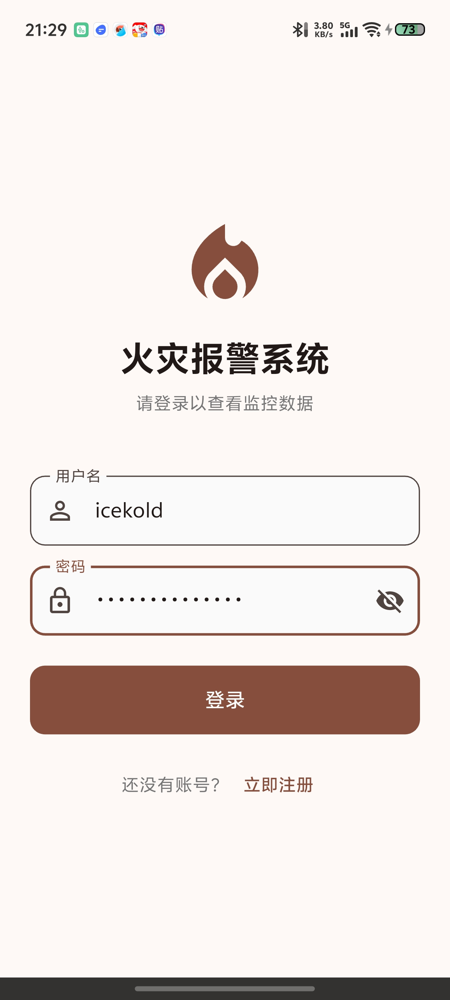
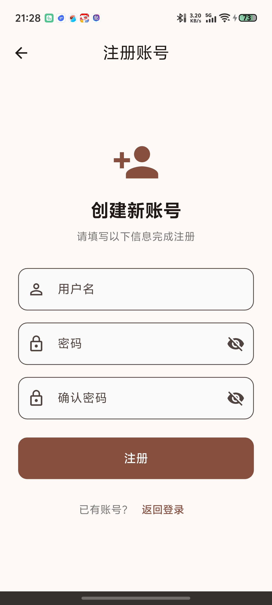
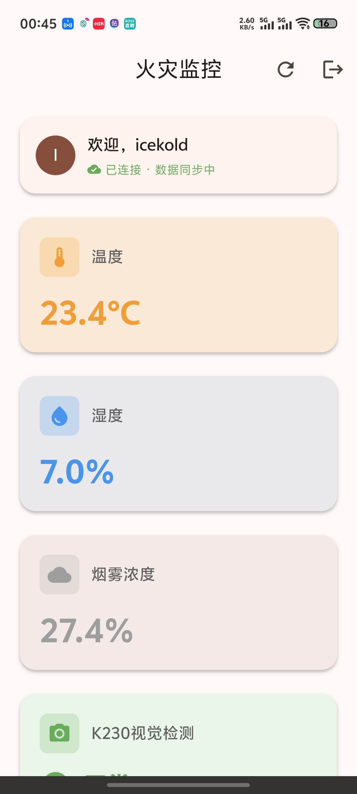
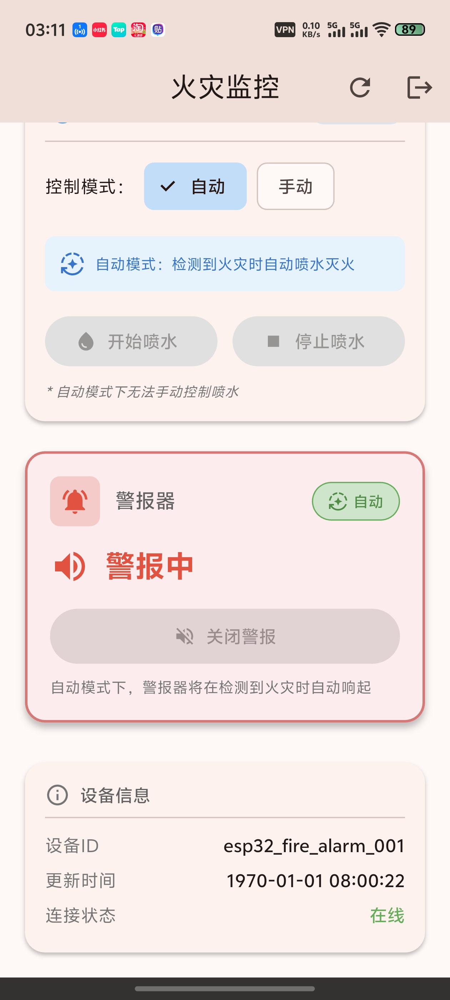
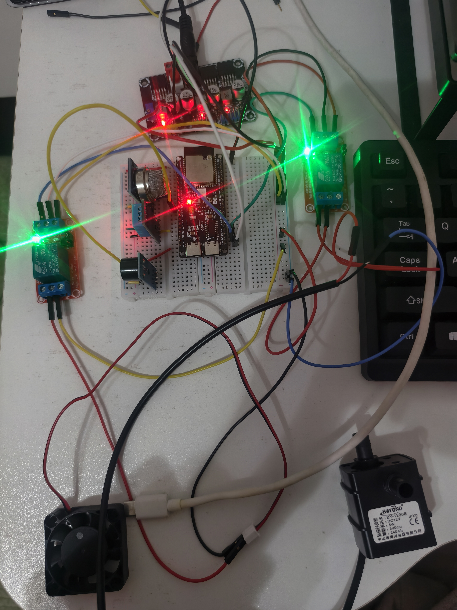

# 项目简介

本项目主题为火宅报警系统，集成了视觉识别、传感器接收、设备驱动、MQTT通信、APP控制等功能模块，旨在实现对火灾的及时监测与报警。系统通过摄像头捕捉环境图像，利用深度学习模型进行火焰和烟雾的识别；同时，传感器实时监测温度和烟雾浓度，一旦检测到异常情况，立即通过MQTT协议向用户的移动APP发送报警信息，并触发本地报警与灭火装置。

项目总共开发时间在借助AI的情况下仅有5天，事实上工作量要远比5天时间小得多，如果每天全身心投入6个小时，可能仅仅需要2-3天即可完成。所以项目本身难度并不高

# 项目目录介绍

APP_CODE： 移动端APP代码，使用flutter框架开发。

ESP32_CODE: ESP32-S3代码，使用platformio进行开发。

K230_CODE: 亚博智能K230视觉模块代码。

dataset\det_results: 火宅数据集，共2000多张图片，已经进行过标注。

dataset\mp_deployment_source: 适用于K230的火宅检测模型，模型格式已经转换好了，直接放入K230即可使用。

JPG : 相关效果图片。

app-release.apk: 打包好的APP安装包。
# 效果演示

## APP登录界面

## APP注册界面

## APP主界面

## APP主界面-报警状态

## 下位机组成图

由于5天时间并不足以准备PCB并且进行焊接，手头也暂时没有焊接工具，所以并没有设计PCB，而是使用了面包板进行连接。

## K230视觉模块火焰烟雾检测演示

# ESP32——————FreeRTOS架构说明

## 任务结构

使用FreeRTOS总共创建了6个任务：

Fan_Task: 控制风扇是否转动的任务。有手动和自动模式。

Pump_Task: 控制水泵是否工作的任务。有手动和自动模式。

K230_Task: 与K230视觉模块通信的任务。

Buzzer_Task: 控制蜂鸣器报警的任务。有手动和自动模式。

MQTT_Task: 负责WIFI连接和MQTT通信的任务。MQTT服务器使用公用服务器broker.hivemq.com。

Sensor_Task: 负责读取温湿度传感器和烟雾传感器数据的任务。

## 全局变量处理

传感器数据为全局变量，为避免任务调度过程中对全局变量的冲突，使用了FreeRTOS的互斥锁进行保护。